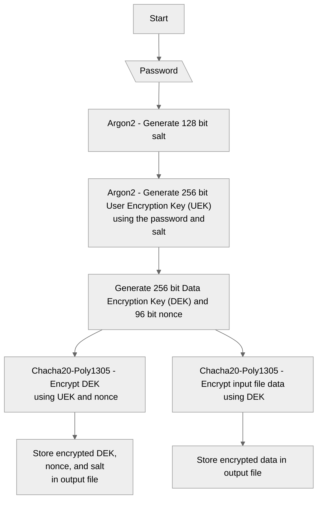

# secure-files-go-gui

This is a GUI for [secure-files-go](https://github.com/darshanags/secure-files-go) - a file encryption/decryption program written in [Go](https://go.dev/). The [original version](https://github.com/darshanags/secure-files) of the program was written in Zig.

This implements [RFC8439](https://datatracker.ietf.org/doc/html/rfc8439) which uses ChaCha20 as the cipher and Poly1305 for authentication, and [Argon2](https://datatracker.ietf.org/doc/html/rfc9106) for key derivation (KDF) from a given password.

**This is in no shape or form a well-polished program, so use at your own risk.**

## Binaries
The latest binaries can be found under the [Releases](https://github.com/darshanags/secure-files-go-gui/releases) section.

## Screenshots
### Main window

### How errors are presented

### File encryption

### File decryption

## Program Flow
### Encryption

> Written with [StackEdit](https://stackedit.io/).
